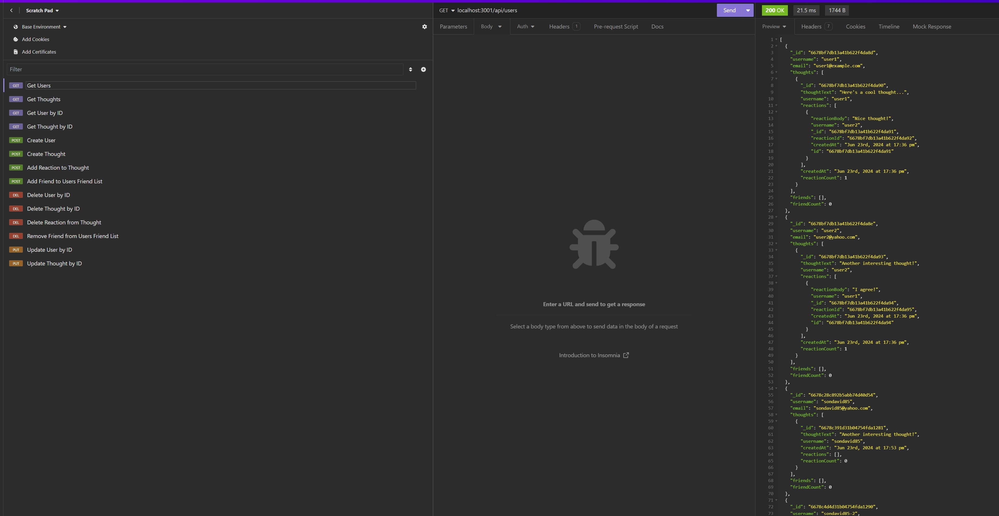

# Social Network API 
  
  ## Description
  A fully functional back-end api for a social network. Can be used to create users, thoughts, reactions to thoughts, and track friends lists.
  ## Video URL
  [demo video](https://drive.google.com/file/d/1S22eiyKgvR47DA1VvrckcUWpgsHRyJs1/view?usp=sharing)
  ## Screenshot
  
  ## Table of Contents
  * [Features](#features)
  * [Languages & Dependencies](#languagesanddependencies)
  * [Usage](#Usage)
  * [Contributors](#contributors)
  * [Testing](#testing)
  * [Questions](#questions)
  ## Features
  CRUD operations on users and thoughts. Ability to track reactions to a thought. Ability to maintain friends list per user.
  ## Languages & Dependencies
  nosql, mongodb, mongoose, express
  ## Usage:
  node, nosql, mongodb, mongoose, express
  ## Contributors
  n/a
  ## Testing
  npm run start to start app and create db/tables if not exists. then, stop the application and run npm run seed to seed the db with dummy values. Finally, npm run start again to start the server. Interact with the server via any api testing tool
  ## Questions
  Please send your questions [here](mailto:sondavid85@yahoo.com?subject=[GitHub]%20Dev%20Connect) or visit [github/sondavid85](https://github.com/sondavid85).
  
